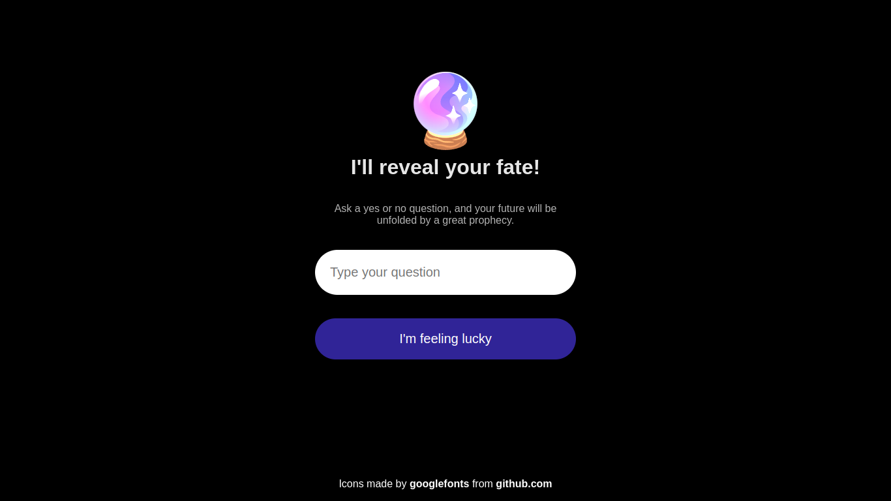

# Divination Crystal Ball

## 📌  Project idea

The Divination Crystal Ball is a fascinating divination website with a beautiful interface that allows users to type a question and receive a random response.

## 💡 Key Features
✅ Interactive interface that invites users to ask questions.

✅ Randomly generated responses for an element of surprise and fun.

## 🔧 Technologies

## 🏗️ Development Details

Crafted with pure HTML, CSS, and JS to create a seamless user experience.

## 📚 My learning Journey

During the development of this project, I acquired valuable skills and knowledge:

📌 Implemented captivating CSS animations.
📌 Worked extensively with JavaScript objects.
📌 Embraced JavaScript arrow functions for concise and efficient coding.

# 🖼️ Screenshots

# Introduction

It is a divination program. The user types a question, and a random response is shown.

It was developed with pure HTML, CSS, and JavaScript.

# 📔 Documentation

## Workflow

1. The user types a question in the input field, and click the button with "Ask" within.
   1. If the input field is empty, show an error message asking for some text.
2. The typed question is shown again beneath the input field, with a random response to that below this.

## Objects

### questionButton

| Attribute      | Definition                                     |
| -------------- | ---------------------------------------------- |
| questionButton | It represents the ask <button> clicked.       |

| Method       | Definition                                      |
| ------------ | ----------------------------------------------- |
| askQuestion  | Button action that shows the response to the question. |
| enable       | It enables the button.                         |
| disable      | It disables the button.                        |

### responseElement

| Attribute         | Definition                                         |
| ----------------- | -------------------------------------------------- |
| possibleResponses | Possible responses that are randomly chosen.      |
| response          | It represents the 
 that will show the question response. |

| Method               | Definition                                                   |
| -------------------- | ------------------------------------------------------------ |
| hideResponse         | It hides the HTML response element.                         |
| randomPossibleResponseIndex | It returns a random index number response for some response to be picked up from the responses array. |
| showResponse         | It makes the response visible to the user.                  |

### questionInput

| Attribute  | Definition                                     |
| ---------- | ---------------------------------------------- |
| question   | It represents the input question of the user. |

| Method    | Definition                                    |
| --------- | --------------------------------------------- |
| isEmpty   | It verifies whether the user has typed something. |
